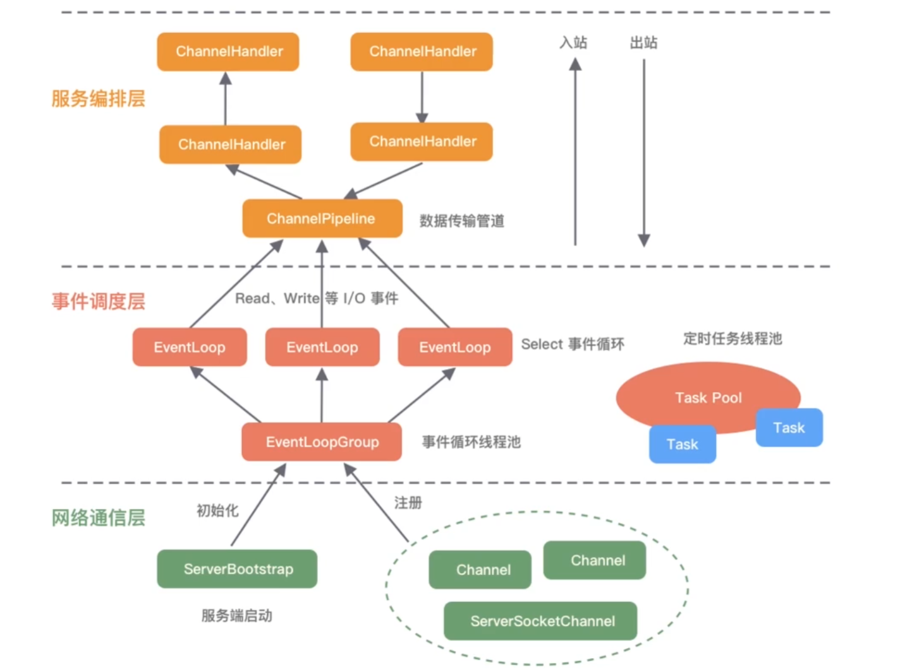

## Netty

一个底层的网络通信框架，帮助我们实现数据的编解码、TCP断线重连、拆包/粘包等一系列的操作。

1. I/O模型、线程模型和事件处理机制
2. 易用性API接口
3. 对数据协议、序列化的支持

I/O请求可以分为两部分

1. I/O调用阶段：用户进程**向内核发起系统调用**
2. I/O执行阶段：内核等待I/O请求处理完成返回

### Netty的I/O模型

基于非阻塞I/O实现，底层依赖的是JDK NIO框架的多路复用器Selector，一个多路复用器Selector可以同时轮询多个Channel。

对于NIO和BIO，可以看这篇文章[Java NIO （图解+秒懂+史上最全）_java nio 图解-CSDN博客](https://blog.csdn.net/crazymakercircle/article/details/120946903)

### Netty的逻辑架构

典型的分层架构。

BootStrap负责整个Netty程序的启动、初始化、服务器连接等过程，可用于连接远端服务器，只绑定一个EventLoopGroup(Boss)。

ServerBootStrap用于服务端启动绑定本地端口，绑定两个EventLoopGroup(Worker)。

每个服务器中都会有一个Boss，会有一群做事情的Worker，Boss会不停地接受新的连接，将连接分配给一个个Worker处理连接。

## RPC

在RPC中服务之间的通信就可以用netty实现。服务在下线时需要从注册中心移除元数据，那么注册中心怎么才能感知到服务下线呢？

- 节点主动通知的实现方式，当节点需要下线时，向注册中心发送下线请求，让注册中心移除自己的元数据信息，但节点异常下线时会出现异常。
- 主动通知+心跳检测
  增加节点与注册中心的心跳检测功能，这个过程也叫做探活，心跳检测可以由节点或者注册中心负责。

