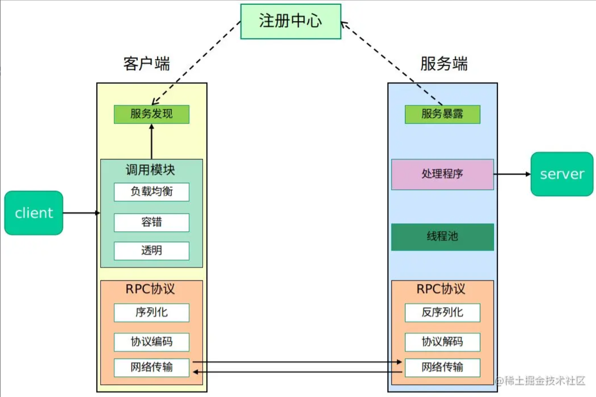

## RPC

RPC，全程Remote Procedure Call [Protocol](https://baike.baidu.com/item/Protocol/5162516?fromModule=lemma_inlink)，远程过程调用，RPC信息协议由两个不同结构组成：调用信息和答复信息。用于解决分布式系统中服务之间的调用问题。就是让开发者们在调用远程服务时像**调用自己定义的服务时简单**，而不是要从创建轮子来发送Http请求，**封装请求协议体**等等一系列复杂的操作。

RPC的基本框架大致是包含几个主要部分，客户端，服务端以及注册中心。

启动过程大概如下

首先是服务端，服务端率先启动，向注册中心注册相关服务和服务对应地址，随后开启服务，监听相应事件（提供服务）。

当客户端需要调用相关接口时，通过RPC框架创建代理对象，通过代理对象来执行相关的方法。客户需要知道的只是有哪些相关的接口，直接调用接口即可。

代理对象帮助客户端发送请求，包括获取到请求所在的URL（从服务注册中心里），配置相关的请求参数，发送请求，返回请求结果。

服务端接收到请求之后的所有操作都由RPC框架来完成，包括获取到请求对应的实现类（通过反射），执行方法后获得结果，将执行的结果写回响应中，返回给客户端。

这一系列操作中涉及到的技术细节可以用以下的图来概括。

因此，接下来着重于这几点的实现：服务治理（注册发现）、负载均衡、容错、序列化/反序列化、编解码、网络传输、线程池、动态代理。后续可拓展的有连接池、日志、安全等。

项目地址：[Zzr-rr/craftRPC: A meticulously engineered Remote Procedure Call framework designed for developers seeking reliability, efficiency, and elegance in their inter-service communications. (github.com)](https://github.com/Zzr-rr/craftRPC)

