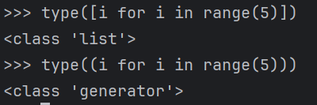
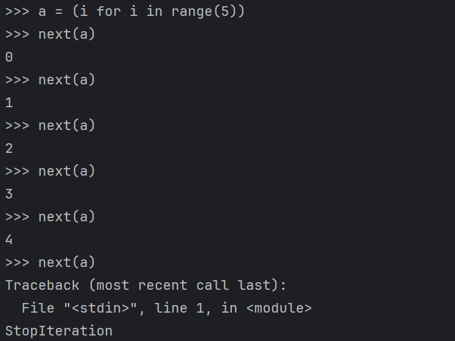
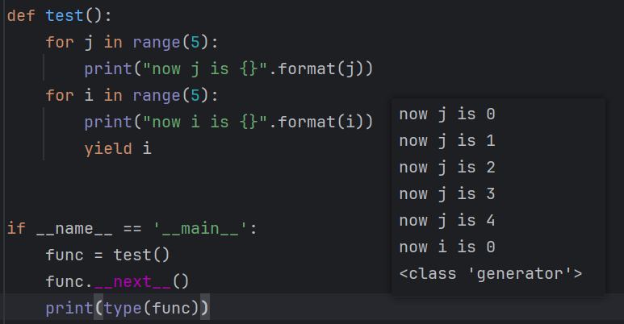

## Python中的generator是什么？

生成器(Generator)是一种返回一个值的迭代器。每次会从该迭代器中取下一个值。

生成器表达式就是用圆括号来创建生成器，就像这样。

这样生成器表达式被称为隐式生成器，他被禁止使用`yield`和`yield from`表达式。基本使用方式如下：

## 生成器函数是什么？

函数如果包含`yeild`指令，那么**该函数调用的返回值**就是一个生成器，每次执行next就会往下执行一步。

可以看到，函数调用next时，会执行到`yield i`这一步，`yield`关键字用于从函数中返回一个值，使得函数能够生成一个值的序列，而不是一次性返回所有值。可以提供更加细粒度的流程控制。