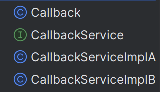

## 什么是回调函数

回调函数就是指能够在代码执行的过程中动态选择需要调用的函数，这种被动态调用的函数就是回调函数。

实际应用中可能有这样的场景，

```java
public void func(){
	// ....
	monitor();
	// ...
}
```

当一段程序在执行过程中需要执行一个监视系统各项指标的函数，而每个开发者又有不同的系统需求，那么则可以由开发者针对自己的系统编写相应的`monitor()`函数，在调用`func()`的过程中传入`monitor()`，这样在函数过程中可以自动地调用该监视函数。


## Java中如何实现回调函数

Java是强对象语言，Java的回调函数一般通过接口来实现，通过定义一个回调函数的接口，通过对该接口的不同实现来定义回调接口。



- Callback函数

  ```java
  import java.util.function.Consumer;
  
  public class Callback {
  
      public static void main(String[] args) {
          System.out.println("callback func test");
          func(new CallbackServiceImplA());
          func(new CallbackServiceImplB());
      }
  
      public static void func(CallbackService callbackService) {
          System.out.println("func start");
          callbackService.callback();
      }
  }
  
  ```

- CallbackService

  ```java
  public interface CallbackService {
      public void callback();
  }
  ```

- CallbackServiceImplA

  ```java
  public class CallbackServiceImplA implements CallbackService {
      public void callback() {
          System.out.println("callback func A");
      }
  }
  ```

- CallbackServiceImplB

  ```java
  public class CallbackServiceImplB implements CallbackService {
      public void callback() {
          System.out.println("callback func B");
      }
  }
  ```

- 执行输出

  ```java
  callback func test
  func start
  callback func A
  func start
  callback func B
  ```


## 如何实现异步调用

只要在调用函数中开启新的线程即可。

```java
public static void func(CallbackService callbackService) {
    System.out.println("func start");
    new Thread(new Runnable() {
        @Override
        public void run() {
        	callbackService.callback();
        }
    }).start();
    System.out.println("调用完成");
}
```


引用一篇[博客]([回调函数—Java实现_java如何实现回调函数-CSDN博客](https://blog.csdn.net/weixin_42536125/article/details/124944989?utm_medium=distribute.pc_relevant.none-task-blog-2~default~baidujs_baidulandingword~default-0-124944989-blog-105261755.235^v43^pc_blog_bottom_relevance_base1&spm=1001.2101.3001.4242.1&utm_relevant_index=3))中的总结点：

> - 回调函数应该在执行另一个操作时执行，或者与该操作并行执行。
> - 回调函数可以被同步执行，意味着它可以在其他操作执行后没有延迟地被立刻执行。
> - 回调函数可以是异步的，这意味着它可以在后台执行，并且可能需要一些时间才能执行
> - Observable设计模式使用回调来通知感兴趣的实体何时发生了操作。