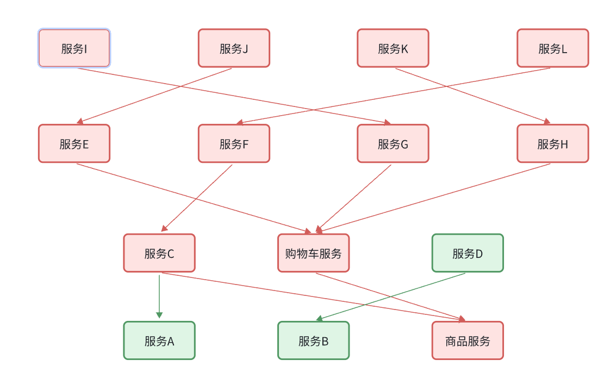

## 什么是雪崩问题

微服务调用链路中的某个服务故障，引起整个链路中的所有微服务都不可用，这就是雪崩。

产生的原因：

- 微服务相互调用，服务提供者出现故障或阻塞。
- 服务调用者没有做好异常处理，导致自身故障。
- 调用链中的所有服务级联失败，导致整个集群故障。

解决思路：

- 尽量避免出现故障或阻塞。
  1. 保证代码的健壮性
  2. 保证网络畅通
  3. 能应对较高的并发请求
- 服务调用者做好远程调用异常的后备方案，避免故障扩散。

## 服务保护方案

### 请求限流

请求限流：限制访问接口的请求的并发量，避免服务因流量激增出现故障。

将波动的QPS处理为平缓的QPS，称之为流量整型。

### 线程隔离

线程隔离：也叫做舱壁隔离，模拟船舱隔板的防水原理。通过**限定每个业务能使用的线程数量**而将故障业务隔离，避免故障扩散。

### 服务熔断

服务熔断：由**断路器**统计请求的异常比例或慢调用比例，如果超出阈值则会**熔断**该业务，则拦截该接口的请求。

熔断期间，所有请求快速失败，全都走fallback逻辑。

## 服务保护技术

Sentinel和Hystrix，结合OpenFeign使用后两者差异不大。

Sentinel是阿里巴巴开源的一款微服务流量控制组件，可以基于控制台配置流量控制规则等等。

**簇点链路**，就是单机调用链路。是一次请求进入服务后经过的每一个被Sentinel监控的资源链。

 