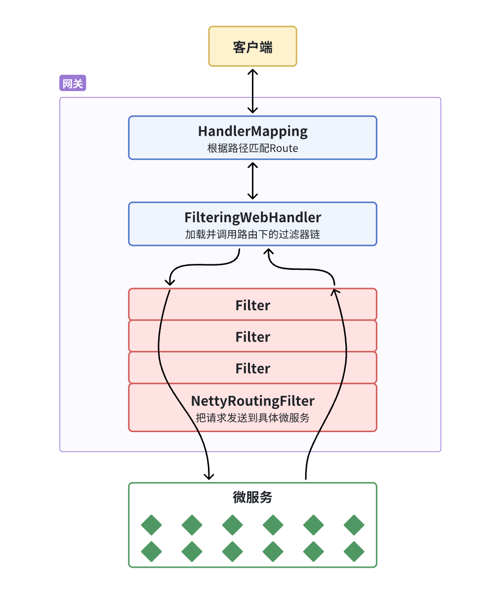

对于微服务架构，对于用户信息的校验，如何统一进行验证？服务拆分之后可能遇到如前端地址过多，服务不知道请求谁。密钥分发麻烦，有泄露的危险等等一系列的问题。

因此，引入网关的概念，网关即是网络的关口，负责请求的路由、转发、身份校验。


## 网关

> 网关(Gateway)又称[网间连接器](https://baike.baidu.com/item/网间连接器/2943752?fromModule=lemma_inlink)、[协议转换](https://baike.baidu.com/item/协议转换/9765368?fromModule=lemma_inlink)器。网关在[网络层](https://baike.baidu.com/item/网络层/4329439?fromModule=lemma_inlink)以上实现[网络互连](https://baike.baidu.com/item/网络互连/108997?fromModule=lemma_inlink)，是复杂的网络互连设备，仅用于两个高层协议不同的[网络互连](https://baike.baidu.com/item/网络互连/108997?fromModule=lemma_inlink)。网关既可以用于[广域网](https://baike.baidu.com/item/广域网/422004?fromModule=lemma_inlink)互连，也可以用于[局域网](https://baike.baidu.com/item/局域网/98626?fromModule=lemma_inlink)互连。 网关是一种充当转换重任的[计算机系统](https://baike.baidu.com/item/计算机系统/7210959?fromModule=lemma_inlink)或设备。使用在不同的[通信协议](https://baike.baidu.com/item/通信协议/3351624?fromModule=lemma_inlink)、数据格式或语言，甚至[体系结构](https://baike.baidu.com/item/体系结构/8174145?fromModule=lemma_inlink)完全不同的两种系统之间，网关是一个[翻译器](https://baike.baidu.com/item/翻译器/2677454?fromModule=lemma_inlink)。与[网桥](https://baike.baidu.com/item/网桥/99310?fromModule=lemma_inlink)只是简单地传达信息不同，网关对收到的信息要重新打包，以适应目的系统的需求。同层--应用层。

简单来说网关就是网络的接口，负责请求的路由、转发、身份校验。

将网关作为一个微服务，让前端对后端的感知为一个单体架构。

Spring提供的两个网关组件：

- Spring Cloud Gateway：基于WebFlux响应式编程
- Netfilx Zuul：基于Servlet的阻塞式编程

网关在**服务注册中心**拉取一系列服务，然后根据前端请求的路由来对微服务进行分发。

1. 创建新模块
2. 引入网关依赖
3. 编写启动类
4. 配置路由规则

网关路由对应的Java类型是RouteDefinition，其中常见的属性有：

- id：路由唯一标识。
- uri：路由目标地址。
- **predicates**：路由断言，判断请求是否符合当前路由。
- **filters**：路由过滤器，对请求或响应做特殊处理。


**网关请求处理流程：**


过滤器内部都由PRE和POST两部分构成，请求进入过滤器内部会先执行PRE逻辑，然后再调用过滤器链中下一个过滤器的PRE的逻辑。

网关过滤器有两种，分别是：

- GatewayFilter：**路由过滤器**，作用于任意指定的路由；默认不生效，要配置到路由后生效。
- GlobalFilter：**全局过滤器**，作用范围是所有路由；声明后自动生效。


**自定义编写一个Filter**

```java
@Component
public class MyGlobalFilter implements GlobalFilter, Ordered {

    @Override
    public Mono<Void> filter(ServerWebExchange exchange, GatewayFilterChain chain) {
        // TODO 模拟登录校验逻辑
        ServerHttpRequest request = exchange.getRequest();
        HttpHeaders headers = request.getHeaders();
        System.out.println("headers = " + headers);
        // 放行
        return chain.filter(exchange);
    }

    @Override
    public int getOrder() {
        return 0;
    }
}
```

