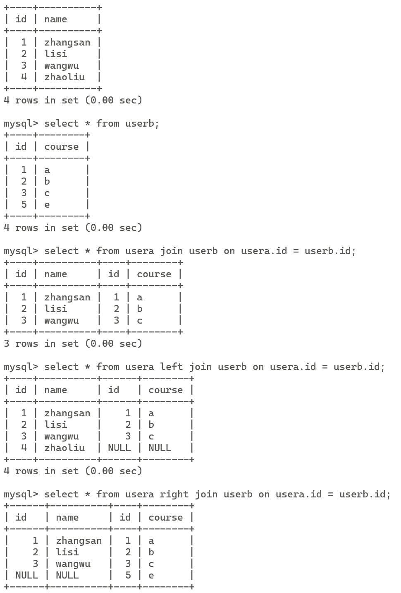

# 数据库

## 内连接外连接

数据库的内连接仅包含符合条件的行，只有两个表相匹配的行才会在结果集中出现。内连接保证两个表中所有行都满足连接条件，外连接则不然。

```sql
SELECT * FROM table1 inner join table2 on table1.column = table2.column
```

外连接就是根据左外连接或者右外连接或者全连接包含了某表的所有数据（如果在另外一个表中无法查询到对应的数据就会将列值置为null）。



## 多表联合查询有哪些方式

内连接，外连接和交叉连接。


## 求最大用什么

一般用MAX函数。

# 测试
## 说一下PO模式

PO模式是一种自动化设计测试模式，将页面定位和操作分开，也就是把对象定位和测试脚本分开，从而提供可维护性。

PO: Page Object

核心思想是通过对界面元素的封装较少冗余代码，主要体现在界面交互细节的封装。

主要是将测试的代码分为三层，**对象库层、操作层以及业务层**。

对象库层用于封装page页面的一些公共的方法，比如初始化方法，查找元素方法，点击元素方法，输入方法，获取文本方法，截图方法等等。

操作层封装对元素的操作，一个页面封装成一个对象。

业务层将一个或者多个操作组合起来完成一个业务功能。


## 测试的流程

需求分析、测试计划、测试准备、测试执行、测试总结。


## 怎么进行测试用例设计

**测试用例应该是明确、具体和可测量的**。每个测试用例都应包含以下要素：

- **输入数据和操作步骤：**明确指定输入数据和操作步骤，以模拟真实使用情况。
- **预期结果：**明确指定每个测试用例的预期输出结果。
- **前提条件：**指定每个测试用例执行的前提条件，确保测试环境的准备。
- **步骤和顺序：**明确指定每个测试用例的执行步骤和顺序。


## 测试用例设计，场景是京东登录界面

分为正向测试用例和负向测试用例。

正向测试用例比较简单，正确的用户名和密码，记住用户名按钮。

负向测试用例即是不正确的用户名和不正确的密码，以及空的用户名和密码之间的排列组合。

安全性和合规性的检测主要是密码可见性切换，密码输入错误次数限制，验证码功能。

响应性测试，不同的UI界面上的界面。


## selenium的元素定位有哪些

ID定位，Name定位，Class Name定位，Tag Name定位。

## 用selenium怎么处理多窗口？怎么处理弹窗？
1. **获取当前窗口句柄**：在点击打开新窗口之前，先获取并存储当前窗口的句柄（一个唯一的标识符）。
2. **执行操作打开新窗口**：执行操作，如点击链接，这将打开一个新的窗口或标签页。
3. **获取所有窗口句柄**：获取打开的所有窗口（或标签页）的句柄。
4. **切换到新窗口**：通过比较句柄，找到新打开的窗口，并切换到该窗口。
5. **在新窗口中执行操作**：在新窗口中进行所需的操作，如填写表单、点击按钮等。
6. **关闭新窗口并返回原窗口**：完成操作后，如果需要，可以关闭新窗口并切换回原始窗口。


# python
## 列表和元组有什么区别

列表可变，元组不可变，更能保证数据的安全性。

## 如何判断两个对象相等

等值性和同一性。`== `和`is`。

# 手撕（讲思路）
## 判断高频词

topk，桶排序。

## 将两个有序数组或链表合并为一个，不改变顺序

维护两个指针，维护一个有序数组。