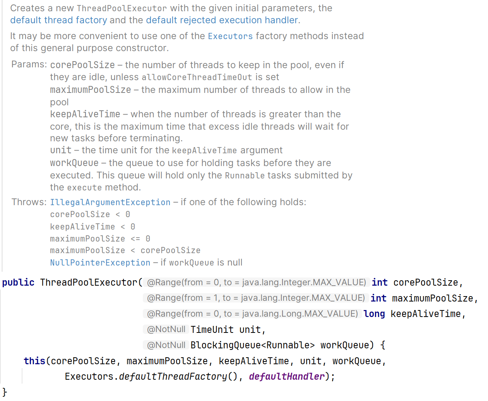

## 1.手撕代码，全排列

回溯。

## 2.介绍java线程池，有哪些参数，都是干什么的

线程池一般可以通过Executor和ThreadPoolExecutor来创建。

且一般来说不允许通过Executor来创建，目的是使得同学更加明确线程池的运行规则，规避资源耗尽的风险。

ThreadPoolExecutor的参数有

**corePoolSize**：核心池大小，用于表示能够存放在线程池中的线程数量。

**keepAliveTime**：表示当线程池的大小满了之后，空闲的线程能够存活的时间。

**workQueue**：消息队列。

## 3.介绍垃圾回收器，G1垃圾回收器有Full gc吗

常见的垃圾回收器有Serial串行垃圾回收器，Parallel并行垃圾回收器，以及它们对应的针对于老年代的垃圾回收器。后又有CMS垃圾回收期和G1垃圾回收器，在JDK11开始实验的ZGC垃圾回收器。

先默认使用的大多是G1垃圾回收器，G1垃圾回收器主要有初始标记，并发标记，最终标记和筛选清除几个步骤，其底层通过维护了一个优先队列来决定清除哪些对象。

当老年代满的时候就会发生FULL GC，G1垃圾回收器中的FULL GC也是串行实现的。

## 4.mysql事务隔离级别，可重复读怎么实现的

mysql的事务的隔离级别有读未提交，读提交，可重复读和串行化，默认的隔离级别是可重复读。

可重复读的实现主要是通过Read View来实现的，即创建一个数据快照，可重复读在事务开启前创建一个数据快照，在当前事务下读取到的数据库内容都是相同的。

## 5.介绍一下mysql索引

mysql的索引底层的数据结构是B+树。索引也分为主键索引和二级索引，当通过二级索引进行查询时可能会发生回表的操作，因此我们在设计数据库表的时候尽量避免回表，尽量用到索引覆盖。

可以简单理解索引就是数据的目录。

按数据结构分索引有B+树索引和hash索引。

按物理存储可以分为聚簇索引和二级索引。

按字段特性可以分为主键索引、唯一索引、普通索引和前缀索引。

按字段个数可以分为单列索引和联合索引。

## 6.sql题，看索引是否会失效

## 7.缓存穿透，击穿，雪崩，如何搭建Redis集群

穿透：访问缓存中不存在的数据。

击穿：大量访问单点数据，数据失效后击穿数据库。

雪崩：大量数据同时失效。

Redis集群至少需要3个节点，因为投票容错机制要求超过半数以上认为某个节点挂了才是挂了。

## 8.询问项目

## 9.反问