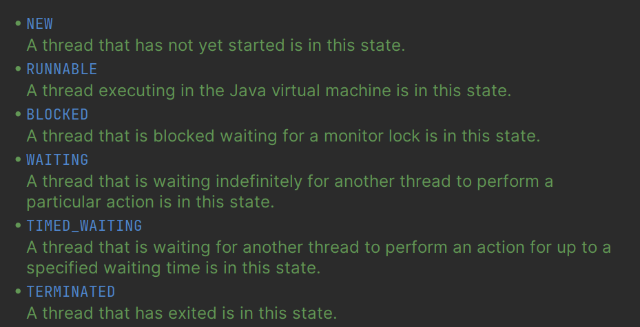

## 1、平时都是用java语言吗

## 2、集合分为哪几类

一类继承自Collection接口，一类继承自map接口。

集成自Collection接口的用于存放数据的会比较多，而集成自map接口的一般用于存放键值对。

大概可以分为List、Set、Queue、Deque、Map这五类集合。

## 3、arraylist底层

arraylist的底层是`Object`数组队列，相当于一个动态数组。

## 4、声明arraylist，java语言会做什么操作

```java
public ArrayList(int initialCapacity) {
        if (initialCapacity > 0) {
            //如果传入的参数大于0，创建initialCapacity大小的数组
            this.elementData = new Object[initialCapacity];
        } else if (initialCapacity == 0) {
            //如果传入的参数等于0，创建空数组
            this.elementData = EMPTY_ELEMENTDATA;
        } else {
            //其他情况，抛出异常
            throw new IllegalArgumentException("Illegal Capacity: " +
                    initialCapacity);
        }
    }
```

~~首先是声明的时候有没有传递参数，如果没有传递参数，就会默认一个数组的大小，这个默认值是10，~~然后如果传递了参数，就声明一个最初容量大小的object数组。同时会对Arraylist中的某个elementData这个属性进行赋值。

如果说没有传递参数，一开始是不会创建一个默认大小的数组的，只有在添加元素时才会调用`ensureExplictCapacity`来确保数组能够满足这个容量大小。

还有一种创建的方式就是传递一个Collection元素的列表。

## 5、arraylist什么时候扩容

当需要添加进入的元素的个数大于arraylist的elementData.length时，arraylist就会进行扩容，它会扩容到之前数组大小的1.5倍，但是这也不是没有上线的，当数组大小的1.5倍超过了设置的默认值，那么就会采用该默认值作为扩容后的大小。

## 6、arraylist是线程安全的吗

不是，对arrayList的操作并不能保证原子性。

## 7、线程安全的list有哪些

CopyOnWriteList和Collections.syncronized方法来为List的一系列方法来加锁。

## 8、hashmap的底层原理

jdk1.8之前hashmap是通过数组和链表来实现的。**链表用于存储冲突的元素。**主要是通过元素的hashcode+扰动函数（减轻碰撞）来得到一个hash值，通过(n - 1) & hash 来决定存放的位置。

JDK1.8之后主要是对链表的处理，当链表的长度大于阈值（默认是8）时触发，首先看数组长度有没有超过64，没有超过64的话就先扩容数组。如果超过了64就把链表转化为红黑树。


## 9、解决hash冲突一般有哪几种方法

拉链法 | 探测法：线性探测、二次探测、双重哈希 | 可扩展哈希 | 

一致性哈希：保证了在模数变化的时候，节点之前的数据迁移只限于两个节点之间。

通过将数据和服务器都映射到环上，使数据顺时针存到某个节点上。

## 10、hashmap是线程安全吗

不是

## 11、线程安全的map有哪些

ConcurrentHashMap、Hashtable

## 12、hashtable和concurrenthashmap的区别

迭代器的强度不同，concurrentHashmap提供了弱一致性，允许在迭代的过程中其它的并发程序修改元素，而hashtable则不允许。

锁的细粒度不同，hashtable锁的粒度更小，它对几乎每一个单一操作都加了锁；而concurrentHashmap使用了分段锁，segment locking，在java8之后使用CAS操作的方法（只在必要的方式使用syncronized）大大提高了并发读写的效率。

## 13、concurrenthashmap最耗时的操作是什么

结构性修改的操作，比如说扩容操作，删除操作等。

## 14、java线程有哪几种状态

有6种状态，NEW, RUNNABLE, BLOCKED, WAITING, TIMED_WAITING, TERMINATED;



15、线程之间如何通讯

共享内存、管道、信号量、管道

16、进程和线程的区别

一个进程可以有多个线程，进程中的堆和方法区是多个线程共享的，每个线程又有自己独立的程序计数器，虚拟机栈和本地方法栈。

17、字符串常量池的理解

为了避免重复创建新的字符串，那么java提供了一个常量池来存储一些字符串常量，这样在下次使用的时候就可以直接使用常量池中的字符串，能够节约内存的开销。

18、jvm的内存模型


19、堆分为哪几个模块

20、讲一下full gc和young gc的区别

21、代码有没有办法手动触发gc

22、执行system.gc()系统会发生什么

23、会立即触发回收吗

24、jvm的gc有哪几种常见的算法

25、java的字节码文件的加载过程

26、java的常量在哪个阶段被赋值（答错了）

27、双亲委派机制

28、双亲委派主要解决什么问题

29、mysql的索引实现和使用

30、mysql的隔离级别

31、数据库默认隔离级别

32、项目有没有做过数据库优化，然后是这么做的

33、syncronized的实现原理

34、syncronized和lock的区别

35、怎么创建一个线程，怎么创建线程池

36、创建线程池需要注意什么

37、什么是死锁

38、怎么避免死锁

39、有了解过设计模式

40、进程之间的通讯方式有哪些

管道：匿名管道（父子进程之间共享）和有名管道

信号、信号量、socket、消息队列、共享内存。